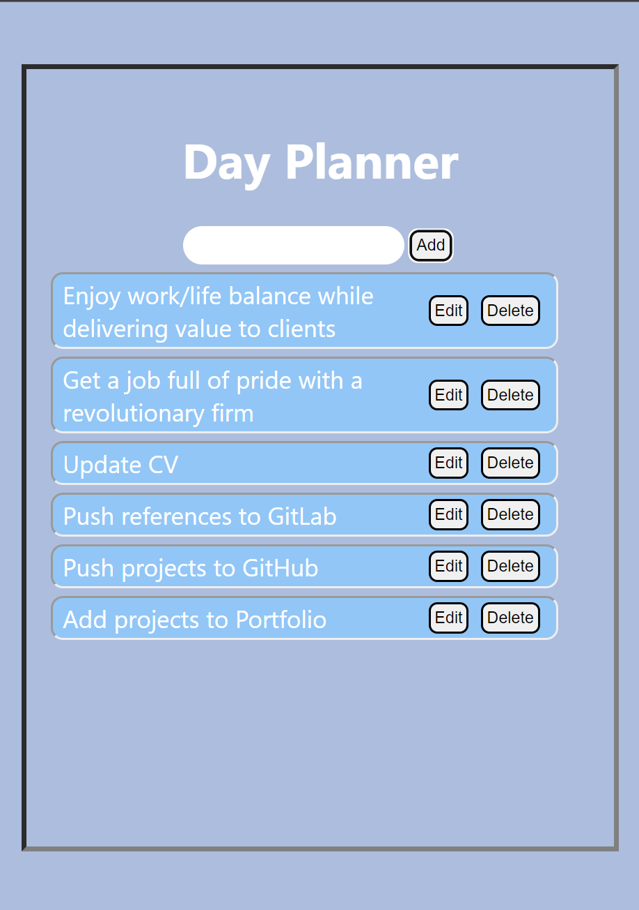
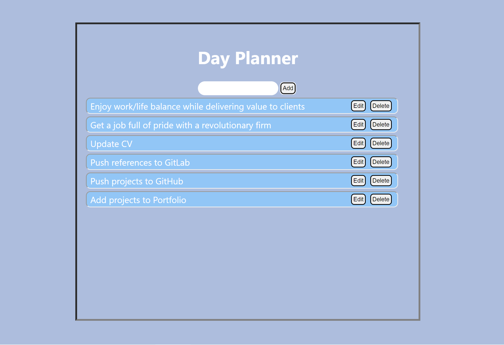
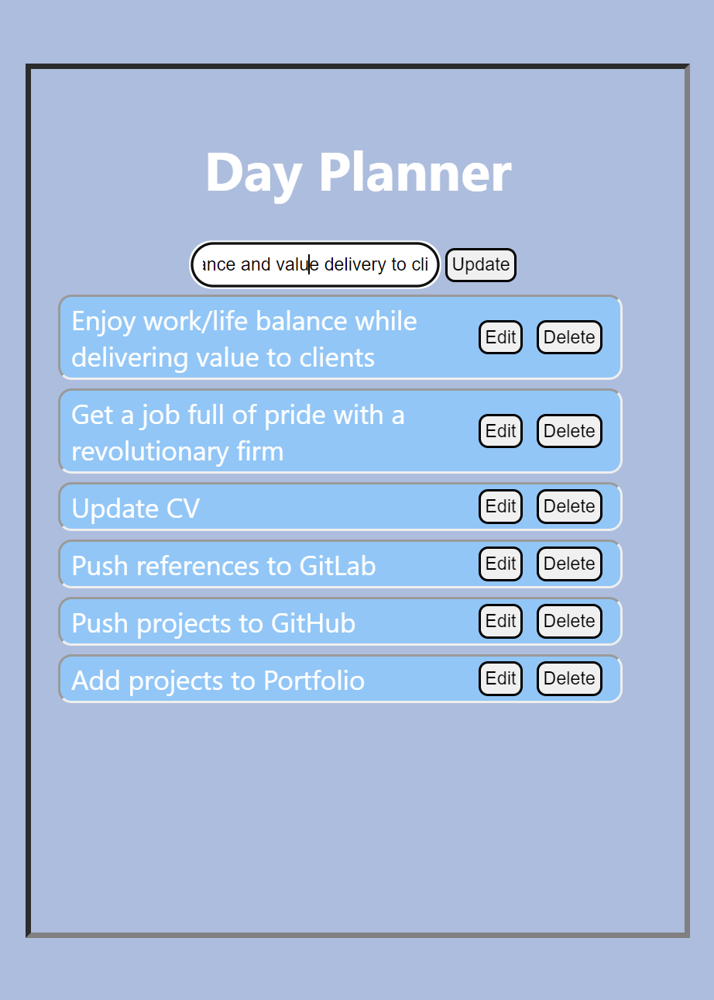
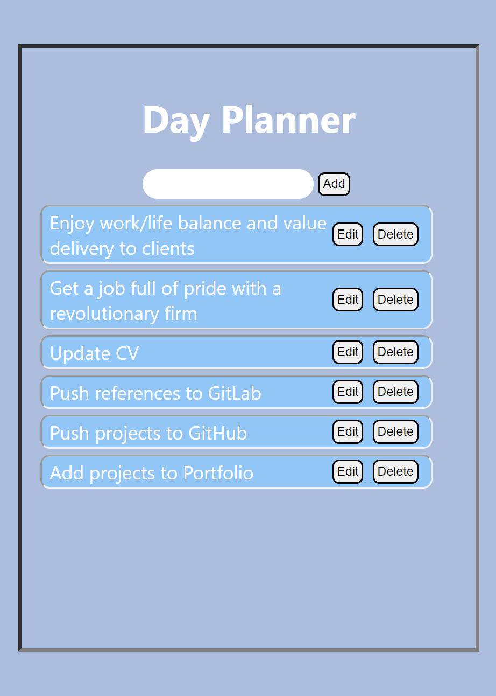

# Day Planner: The Task/Time Listing App

This app is built with [Create React App](https://github.com/facebook/create-react-app).

## Available Scripts

In the project directory, you can run:

### `npm start`

Runs the app in the development mode.\

Open [http://localhost:3000](http://localhost:3000) to view it in a web browser.
The page will reload if you make edits.\

## Functionalities

Sit in your work chair and by your desk with a web broswer in front of you. The browser may be in laptop, desktop, smartphone or any future device with a supporting GUI.

With Day Planner, at the start of the fine workday-
1. You can add tasks.
2. You can edit tasks.
3. You can remove tasks.

While leaving the work chair and desk to return the next day (Bis morgen!), you may clear your mind as well as the task list for a fresh start next time.

## Screenshots

### Adding and removing tasks
Adding and removing tasks - small display

Adding and removing tasks - large display
  
  
### Editing task
Changing todo description
  
  
Saving the task with its new description
  
  

## Thanks!
